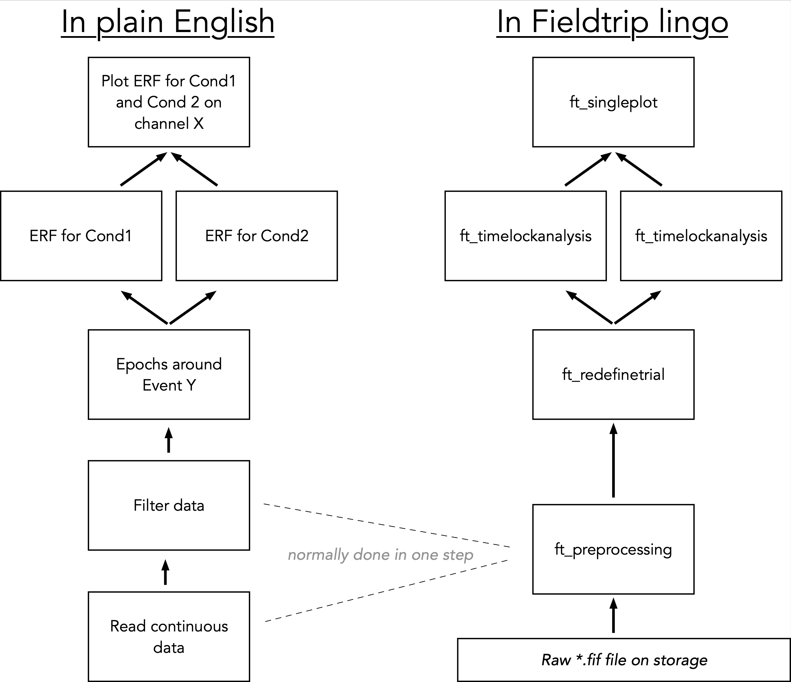

[TOC]

# Basic Fieldtrip Philosophy

As stated previously is a collection of functions for signal processing or statistical analysis of electrophysiological data. These functions are called from the command line or from custom-made scripts / functions. Almost nothing relies on GUIs, which I personally find to be an advantage. But if you are a GUI person, then turn to other options (e.g. SPM; the M/EEG part actually relies quite a lot on Fieldtrip). Most fieldtrip functions start with a "ft_" prefix, thereby avoiding conflicts with other toolboxes that use identical function names (e.g. "topoplot.m" was also used by EEGLAB). Following the prefix, usually is a term that describes what the function does (e.g. "ft_topoplot.m" would plot a topography). Generally you don't have to be a coding genius to set up easy (standard) analysis pipelines, which is fascilitated by the fact that almost all Fieldtrip functions have a common structure, making code usually quite human-readable.

> dataout = ft_dostuff(cfg, datain);
>
> or
>
> dataout = ft_dostuff(cfg);

A crucial and neat element is the "cfg"-bit which is a Matlab-stucture containing the configuration options for the function call. 

> cfg = [];
>
> dataout = ft_dostuff(cfg, datain);

Passing an empty cfg-structure would just use the default settings.

> cfg = [];
>
> cfg.option1 = 'yes';
>
> cfg.option2 = 30;
>
> dataout = ft_dostuff(cfg, datain);

Having the configuration settings visible helps also others to understand what you did and also makes it easier to identify where to make modifications when e.g. nasty reviewers request changes to your analysis (sometimes it is just setting a cfg-option to a different value and just rerunning everything on the cluster). **Make sure to set your cfg to be empty (=[]) when calling a new function.**

Normally (at least the high-level) Fieldtrip functions work on specific data-strutures which we will encounter more concretely later. The main data structures are:

* *Preprocessing*: Contains either continuous or epoched raw data.
* *Timelock*: Contains evoked responses.
* *Freq*: Contains output following spectral analysis.
* *Source*: Contains output following source analysis.

# Make a "pipeline" and translate it into Fieldtrip steps

Whatever you do, don't just start with a blind analysis. Have a clear idea what you want to know from your data. A good approach is to start with an idealized iconic figure that would support / resolve your main research question and reverse engineer the necessary analysis steps. For example I want to show that the evoked response for two conditions is different on certain sensors. Start with a boxes and arrows chart and work your way backward:

As you can see, most standard analysis steps can be easily mapped in a straight-forward manner from "plain English" into "Fieltrip-lingo".

# The MEG lab's standard approach

# What we want to do

- Preprocessing ICA ... RESTING STATE
- Epoch data experiment
- timelockanalysis
- Excursion: simple decoding
- spectral analaysis
- 1 beamformer + virtual channel reconstruction

