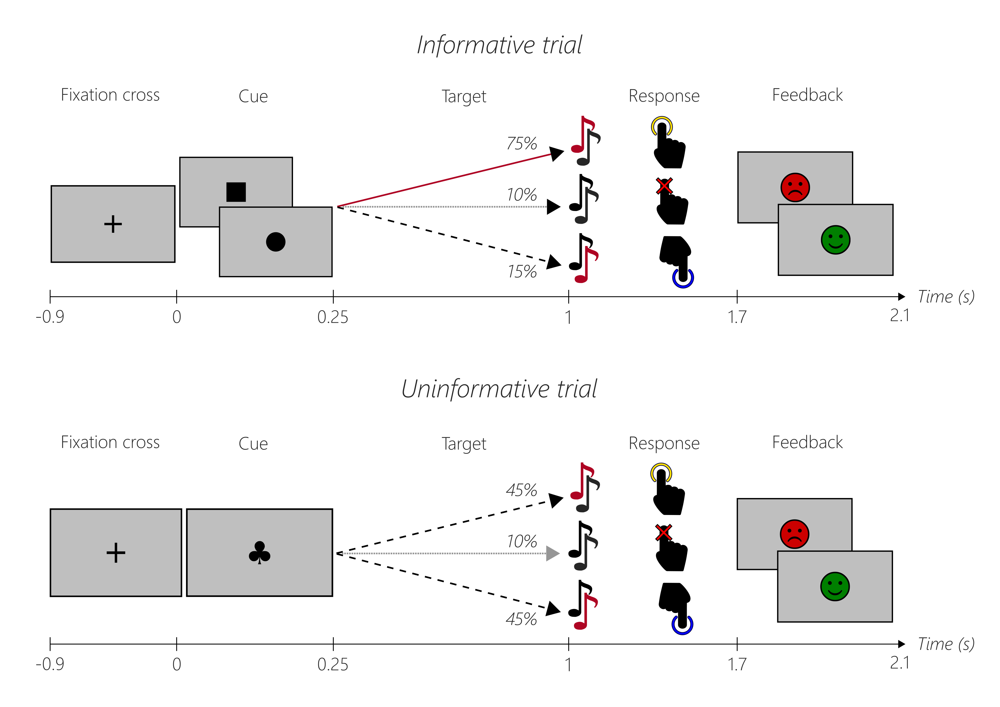

# The Experiment

For this tutorial we will use an auditory attention task by Juliane & Patrick, in which, after a cue-target period, two tones were played simultaneously. One of them was occasionally amplitude-modulated and participants had to press the correct button (or no button when there was no modulation).

The task consisted of informative and uninformative trials. An **informative trial** started with a fixation cross in the center of the screen that lasted for 900 ms. Afterwards, one of two cues for the high or low tone target was presented (square or circle, balanced across participants). 

The cue was presented for 250 ms and there were three different cases that could occur:

1. The first case occurred in 75% of the trials and the cue gave a correct hint on which tone will be the amplitude-modulated target tone (e.g. high tone cue - target in the high tone). 

2. In 15% of the trials the cue was invalid and gave a wrong hint (e.g. low tone cue - target in the high tone). 

3. In 10% of the trials no tone was the target tone.

**Uninformative trials** had a cue in form of a playing card symbol (club) and the participant got no information in which frequency the target tone will be. 

1. In 45% of the trials, the low tone was the target tone and in another 45% the high tone was the target. 

2. In 10% of the trials, there was no target tone. One trial had a maximum duration of 3 s.

Following a silent period of 750 ms, the two tones were played simultaneously for 100 ms and participants were able to give their response immediately within a period of 700 ms. 

* When participants perceived the target in the high tone, the button for the high tone needed to be pressed. 

* For responding to the low tone target, a different button was used. 

* When participants perceived no target at all, they should not press any button.

After every response, feedback in form of a happy and sad smiley was shown for 400ms.

There were in total 300 trials per block (100 per cue). For the informative trials, this resulted in 150 valid trials, 30 invalid trials and 20 no-target trials. For the uninformative trials, 45 high tone target trials, 45 low tone target trials and 10 no-target trials were presented. One block was ~15 minutes long.

Now it's time to move on to the [preprocessing](03_ICA_Preprocessing.md).
