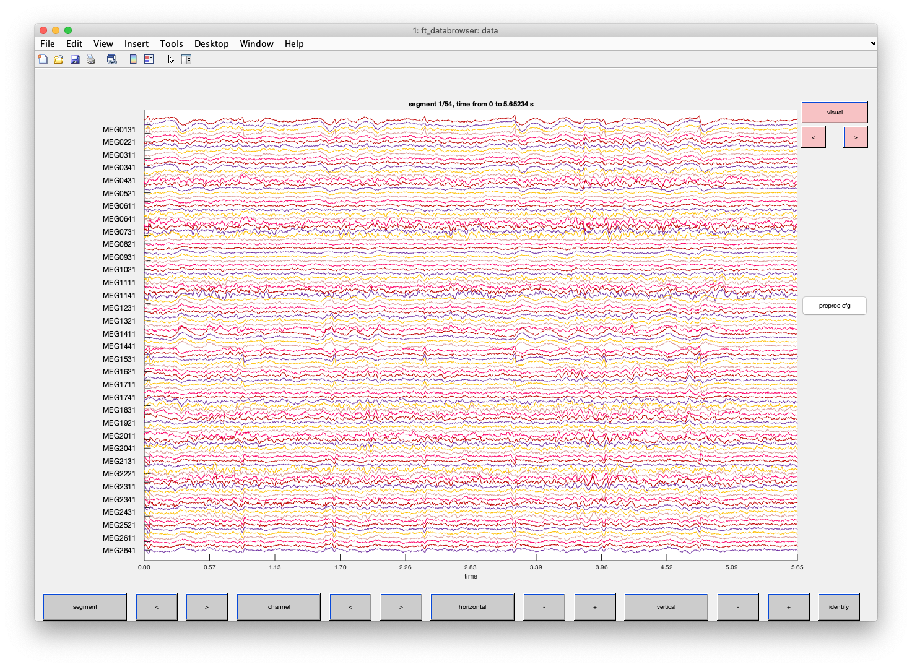
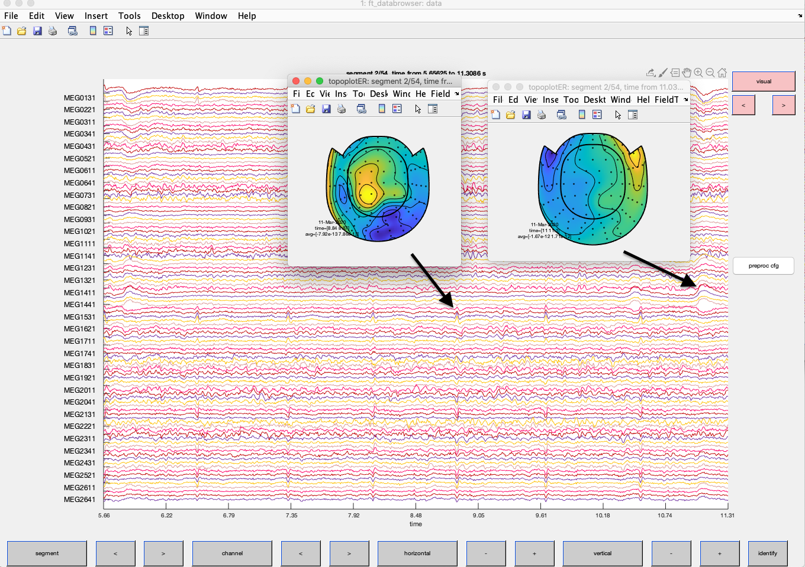
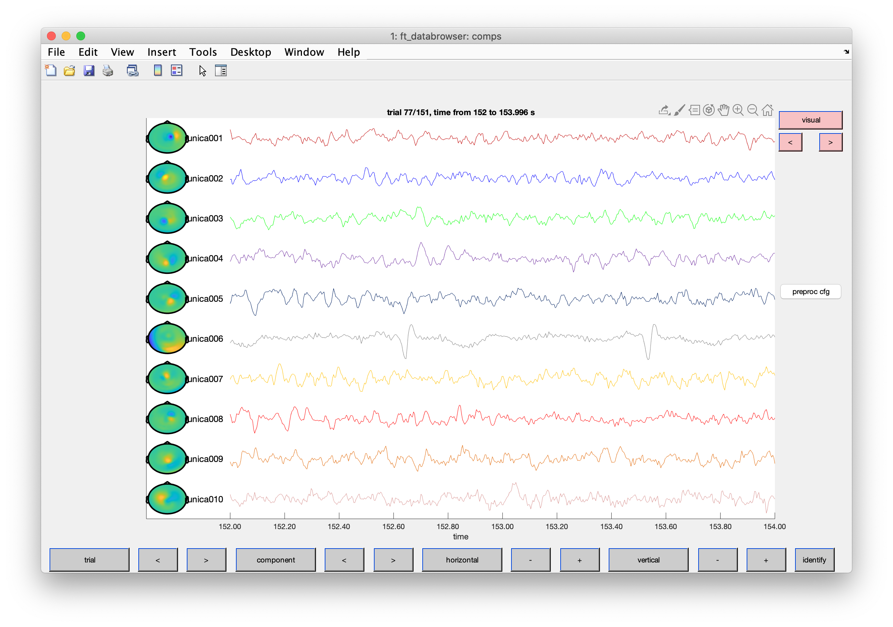
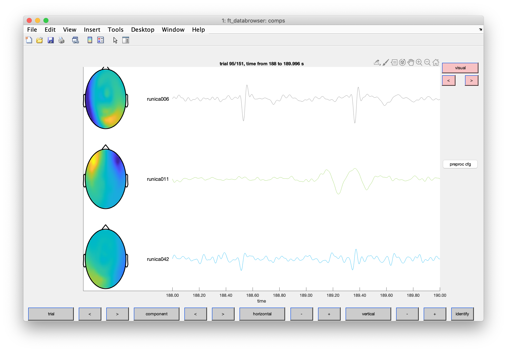
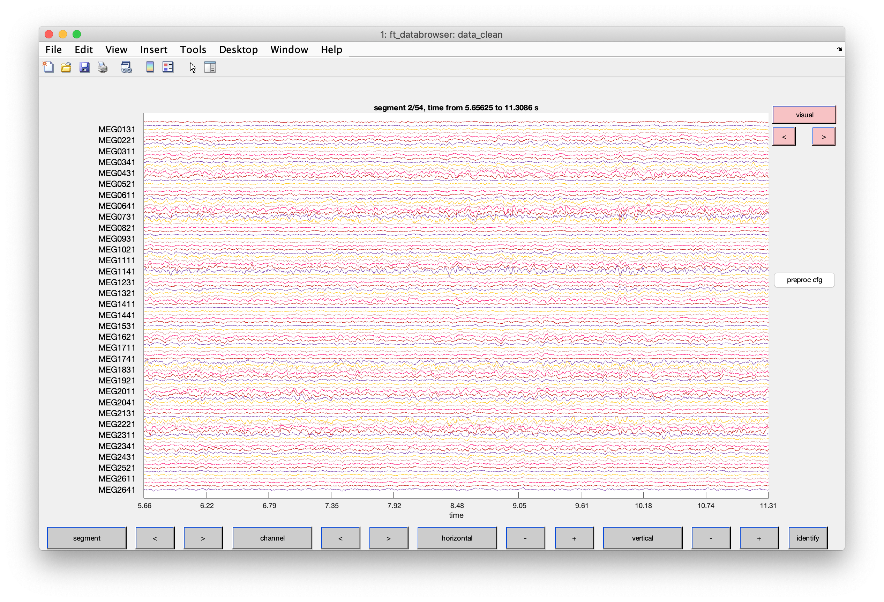

[TOC]

# Your point of departure

So you have conducted an experiment in the MEG lab and your continuous data is on the storage as a fif-file. For the vast majority of experiments, we normally apply Maxfilter (see below) to the data. In case you are not entering the MEG with something weird (e.g. tES or OAE-probes etc.), then -from our introspective perspective- the SNR is improved for most analysis (improving e.g. your later stats or decoding results). 

> **_What does  Maxfilter do?_**
>
> This is a program provided by the MEG vendor (formerly Elekta). There is also an implementation in  [MNE-Python](https://mne.tools/dev/generated/mne.preprocessing.maxwell_filter.html) and in the end probably it is not a big deal for the outcome. However using the Elekta version is probably more comfortable as it automatically detects the bad channels for you, i.e. requires minimal user interaction. In Salzburg, **if you have absolutely no clue what Maxfilter does (which is likely the case) it is strongly advised that you ask the MEG group (e.g. Gianpaolo) to run the tools for you.**
>
> Maxfilter actually is a collection of tools:
>
> - It uses spatial signal space separation (SSS) to identify and remove external noise.
> - Detection and "repair" of bad channels
> - Correction for head movements.
> - Reprojection of data to a different head position. Allows alining across blocks and participants
>
> Note that following Maxfiltering the channels are not fully indepdent of each other anymore, i.e. the rank will be far smaller than the amount of sensors. When running Maxfilter on the 306 MEG sensors, the rank is normally reduced to ~60-70. This needs to be taken into account e.g. for ICA or beamforming.
>
> **_Although in Salzburg things work nicely mostly, it is absolutely necessary that you "sanity" check the output in the databrowser. Sometimes things can go horribly wrong._**

So once this is done, you need to remove the main remaining artefacts, which in the standard case are cardiac activity, ocular activity and (perhaps) train related artefacts. In our standard approach we detect these artefacts using Independent Component Analysis (see e.g. [here](http://arnauddelorme.com/ica_for_dummies/), save the indices of the artefactual components along with the relevant data structure and apply this information "on demand" to continuous or epoched data. 

**Via this approach, you keep all trials for the vast majority of experiments!** 


# So let's do it for this data set

As you can see the experiment consists of 6 blocks with the actual cued attention experiment and furthermore a resting state measurement. There are many possibilities to proceed from here, e.g. concatenating all data sets and computing a giant ICA, randomly subselecting trials or using just data from one condition. The latter is totally legit if you assume that relevant artefactual information is not systematically changed across measurements. How you do it is entirely up to your common sense. So reflect a little before coding like crazy.

Here I have decided to take the resting state data set to define the main artefactual components.

Begin with some standard code snippets. Importantly you need to add the path to your fieldtrip release (or the obob_ownft release; this is a maintained version of fieldtrip along with some locally developed utility functions). Also adapt "datapath" to where you have stored the data.

```matlab
clear all
restoredefaultpath

addpath('~/Documents/MATLAB/fieldtrip/') %or path to obob_ownft
ft_defaults %if working with obob_ownft use: obob_init_ft

datapath='~/Dropbox/Teaching/Salzburg/PhD/Fieldtrip_2020/Data/';
fifname_max='19890425HRWL_resting_trans_sss.fif';
```

In the next step we will read the raw data.

```matlab
cfg = [];
cfg.continuous = 'yes';
cfg.channel='MEG';
cfg.hpfilter='yes';
cfg.hpfreq=1;
cfg.lpfilter='yes';
cfg.lpfreq=100;

cfg.dataset     = [datapath fifname_max];
data       = ft_preprocessing(cfg);
```

We don't need 1000 Hz for the ICA, so let's downsample.

```matlab
cfg=[];
cfg.resamplefs=256;
data = ft_resampledata(cfg, data);
```

 You can now check out the raw data a little. In this code I asked only to display magnetometers and also supplied a sensor layour in case I want to check out some topographies.

```matlab
cfg=[];
cfg.channel='MEGMAG';
cfg.layout='neuromag306mag_helmet.lay';
cfg.viewmode='vertical';
ft_databrowser(cfg, data)
```

Notice that the default of showing a 1 second snippet in the window may be not optimal. What is good for you depends also a little on the monitor size you have, so mess around a little with the buttons at the bottom of the databrowser.



When scrawling you can detect some quite obvious artefacts such as regular spiky activity and frequent slower activity. You can use the databrowser to mark a period and use right mouse button to plot some topographies (topoplotER). This gives you a feeling for the sources of your artefact and seeing the same patterns across subjects will train your pattern recognition skills.




> Take a look at the images and the topographies. What artefacts do you think they are displaying?

In a next step epochs are created prior to running the ICA. This is not really necessary here, but if you wanted to run the ICA on a reduced data set or concatenate data across blocks, then having epochs may be useful.

```matlab
cfg=[];
cfg.length=2; % chop out 2 second periods
ep4ica=ft_redefinetrial(cfg, data);
```

Now let's actually compute the components. Note that we need to adjust for actual rank [--> ADD LINK] following MAXFILTER [ADD SOME COMMENT ABOVE]. This is done by specifying XXcfg.numcomponentXX

```matlab
cfg=[];
cfg.method = 'runica';
cfg.numcomponent = 60; % 50-60 components for our purposes
cfg.demean = 'yes';
comps = ft_componentanalysis(cfg, ep4ica);
```

While there may be some clever automated ways of identifying the main artefactual components, in most cases a trained eye can identify them quickly via visual inspection. Use the following code to take a look. Adding a layout also gives you the topographies, which may be useful when interpreting the components in terms of which process caused them.

```matlab
cfg=[];
cfg.layout='neuromag306mag.lay';
ft_databrowser(cfg, comps)
```

You should see something like this ...



Obviously you can scrawl through the data, change the number of topographies to be displayed etc..

> Check whether you can find the ocular and cardiac components.

After some inspection these are the main artefact components that I find. Note that the components and the numbers may look slightly different in your case. For the component 42 which is also ECG related I first detected the suspicious topography and then check whether the waveform changes look time-locked to the main ECG component (you can use the "preproc cfg" button to add some filtering to help this become more visible). 



If you are interested in the "train component", then these are capture on relevant trials (i.e. when there was a train) a sharp 16.6 Hz sinusoidal wave. Check out [this tutorial](https://im.sbg.ac.at/display/MEG/Chapter+4c+-+Train%2C+find+the+component+automatically). In general in most experiments you don't need to be too pre-occupied. 

Now we save the components as well as the indices of the bad components for later.

```matlab
bad=[6 11 42];
save(fullfile(datapath, 'icacomps.mat'), 'comps', 'bad')
```

Not that we are interested in it now but just that you can see the immediate effect of ICA-cleaning, let's apply it to the resting (continuous) data. Note that the data set that we apply the ICA cleaning to could also be at another sampling rate (this is sometimes useful when accelerating the calculations),

```matlab
cfg=[];
cfg.component=bad;
data_clean=ft_rejectcomponent(cfg, comps, data);
```

> Use code from above to plot data_clean.

Displaying the same segment as above the effects should become immediately obvious (i.e. cardiac and ocular artefacts removed).




