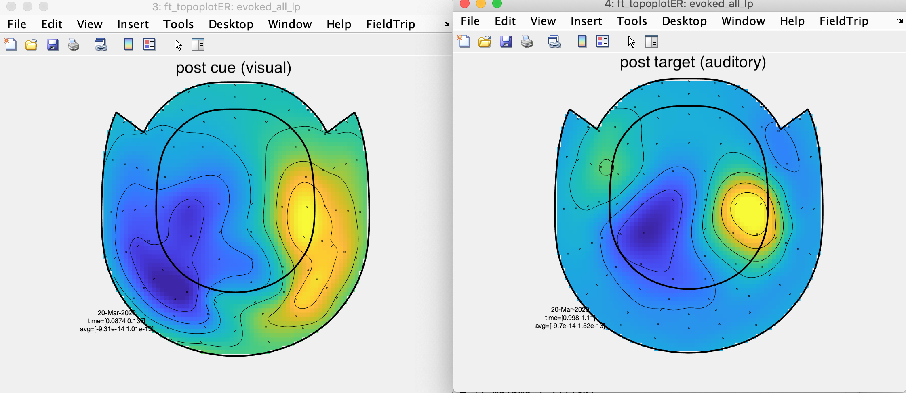
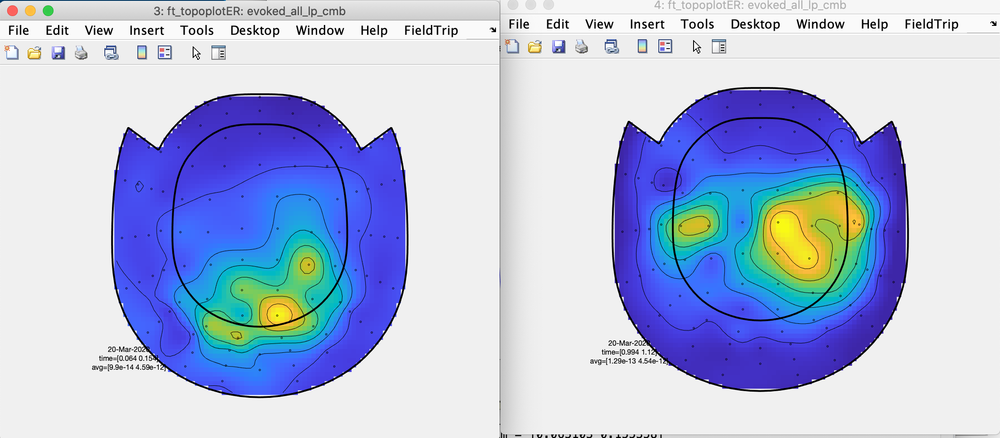

[TOC]

# Let's calculate some evoked responses

In case you have closed Matlab in between, we'll start by loading the epochs (maxfilter'ed and ICA-cleaned) we have created in the previous step.

```matlab
clear all
restoredefaultpath

addpath('~/Documents/MATLAB/fieldtrip/')
ft_defaults

datapath='~/Dropbox/Teaching/Salzburg/PhD/Fieldtrip_2020/Data/'; %adapt on your computer
epoch_file='epochs.mat';

load(fullfile(datapath, epoch_file))
```

## Check the preprocessing structure

Let's take some time to check the fields of our *preprocessing*-structure.

```matlab
alldata = 

  struct with fields:

        label: {306×1 cell}			%contains sensor labels (102 Mags, 204 Grads)
    trialinfo: [1800×1 double]	%contains trigger values (4th column of the trl-matrix)
         grad: [1×1 struct]			%contains the sensor information (coil position etc.)
        trial: {1×1800 cell}		%contains the actual epoched data
         time: {1×1800 cell}		%contains the time vector
      fsample: 256							%the sampling rate
          cfg: [1×1 struct]			%the current and previous configuration structure(s)
```

A seeming curiosity of Fieldtrip is the storage of the trials and time(s) as cells. The reason for this is that Fieldtrip allows for unequally sized trials.


## Averaging over all trials

The basic call for calculating evoked responses is *ft_timelockanalysis*. We start by simply averaging over all trials. We will use *ft_multiplotER* to plot the evoked responses over all magnetometers, starting at a point close to onset of the visual cue and finishing briefly following sound onset.

```matlab
cfg=[];
evoked_all = ft_timelockanalysis(cfg, alldata);

cfg=[];
cfg.xlim = [-.2 1.4];
cfg.layout='neuromag306mag_helmet.lay';
ft_multiplotER(cfg, evoked_all)
```

The multiplotot is interactive, i.e. you can select sensors and within these images you can select periods to get a topography. Exploring data in this way gives you a good feeling for MEG data.

In the previous call we passed on an empty configuration structure. Even though the evoked response is beautiful (1800 trials after all), you may sometimes want to add some preprocessing options. In the following we will add low-pass filtering as not uncommon in the evoked response literatur. Using *ft_multiplot* we can then plot both *timelock*-structures.

```matlab
cfg=[];
cfg.preproc.lpfilter = 'yes';
cfg.preproc.lpfreq = 30;
evoked_all_lp = ft_timelockanalysis(cfg, alldata);

cfg=[];
cfg.xlim = [-.2 1.4];
cfg.layout='neuromag306mag_helmet.lay';
ft_multiplotER(cfg, evoked_all, evoked_all_lp)
```

You can select specific sensors to see that the filtered response is smoother.

Using the interactive multiplot features, we can check the early and later topographies and confirm a (dominant) posterior and two temporal sources, which makes sense (sanity check!!).



"Reading" sources from magnetometers is sometimes challenging and more straight-forward using your gradiometers. For this you need to combine the planar gradiometers at one location. 

```matlab
cfg=[];
evoked_all_lp_cmb = ft_combineplanar(cfg, evoked_all_lp);

cfg=[];
cfg.xlim = [-.2 1.4];
cfg.layout='neuromag306cmb_helmet.lay'; %Note that the layout changed
ft_multiplotER(cfg, evoked_all_lp_cmb)
```

Again we can use the interactive multiplot features and selecting similar (not 1000% equal) time periods, can can see a confirmation of or previously drawn source assumptions.




## Averaging over conditions

  % Cues: 
    % High tone cue valid = 8
    % High tone cue invalid = 9
    % High tone cue no target = 9
    %
    % Low tone cue valid = 4
    % Low tone cue invalid = 5
    % Low tone cue no target = 5

The previous analysis is nice to get a general look and feel of the data, but will obviously not revolutionize cognitive neuroscience. In this part we will compare our conditions, i.e. when the cue was informative or not. As you remember the informative cues (disregarding validity) had trigger values 8/9/4/5 and trigger values for uninformative trials was 2. We can find the appropriate trials in the *trialinfo*-field of our preprocessing-structure.

```matlab
trialnums = [length(find(alldata.trialinfo == 2)), ...
                length(find(alldata.trialinfo == 4 | alldata.trialinfo == 5)), ...
                length(find(alldata.trialinfo == 8 | alldata.trialinfo == 9))]
```

As you can see, we have double the amount of informative cues. This would generate a systematic bias when averaging the data. So for the informative trials we will do a subselection of trials (300 trials for each cue type).

```
ind_inf_low = find(alldata.trialinfo == 4 | alldata.trialinfo == 5);
ind_inf_low_300 = ind_inf_low(randsample(600, 300));

ind_inf_high = find(alldata.trialinfo == 8 | alldata.trialinfo == 9);
ind_inf_high_300 = ind_inf_high(randsample(600, 300));
```

Now we are ready for subaveraging.

```matlab
cfg=[];
cfg.preproc.lpfilter = 'yes';
cfg.preproc.lpfreq = 30;

cfg.trials = find(alldata.trialinfo == 2)'; %all uninformative trials
avg_U = ft_timelockanalysis(cfg, alldata); 

cfg=[];
cfg.trials = [ind_inf_low_300; ind_inf_high_300]'; %selection informative
avg_I = ft_timelockanalysis(cfg, alldata);
```

[NOTE: FILTERING SEEMS TO BE APPLIED TP *ALL* TRIALS ... ERROR?]

Before combining the planar gradiometers we will do a baseline subtraction, which is not uncommon in the evoked response literature.

```matlab
cfg=[];
cfg.baseline = [-.1 0];

avg_U = ft_timelockbaseline(cfg, avg_U);
avg_I = ft_timelockbaseline(cfg, avg_I);

avg_U = ft_combineplanar([], avg_U);
avg_I = ft_combineplanar([], avg_I);
```

> Use code snippets above to make a multiplot, including both conditions.

The following code shows a quick way to visualize the difference (we restrict the time to the period closely following the cue).

```matlab
avg_diff = avg_U;
avg_diff.avg = avg_I.avg - avg_U.avg;

cfg=[];
cfg.xlim = [-.2 .4];
cfg.layout='neuromag306cmb_helmet.lay'; 
ft_multiplotER(cfg, avg_diff)
```

> Discuss a little what you see. Change the layout.

It's time to take a different look at the data, with the [induced responses](06_Induced_Response.md).
