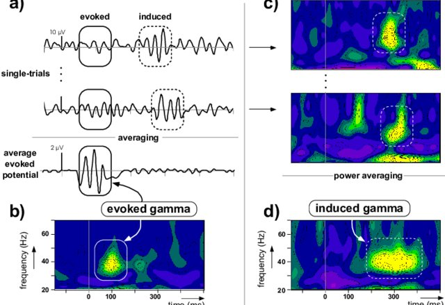
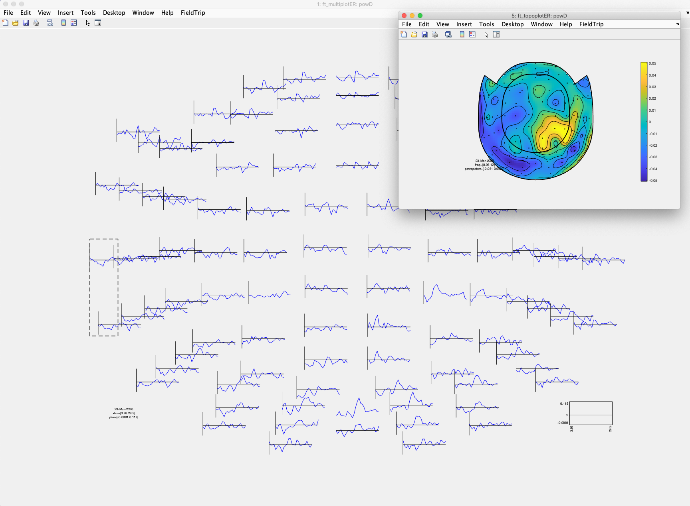
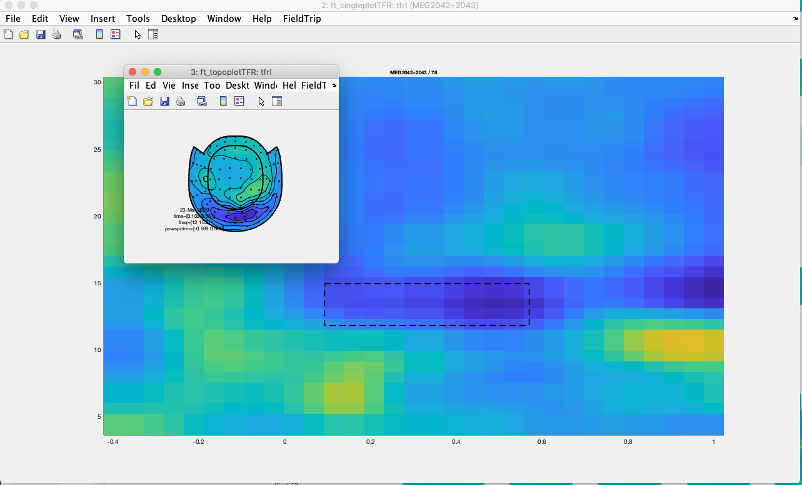
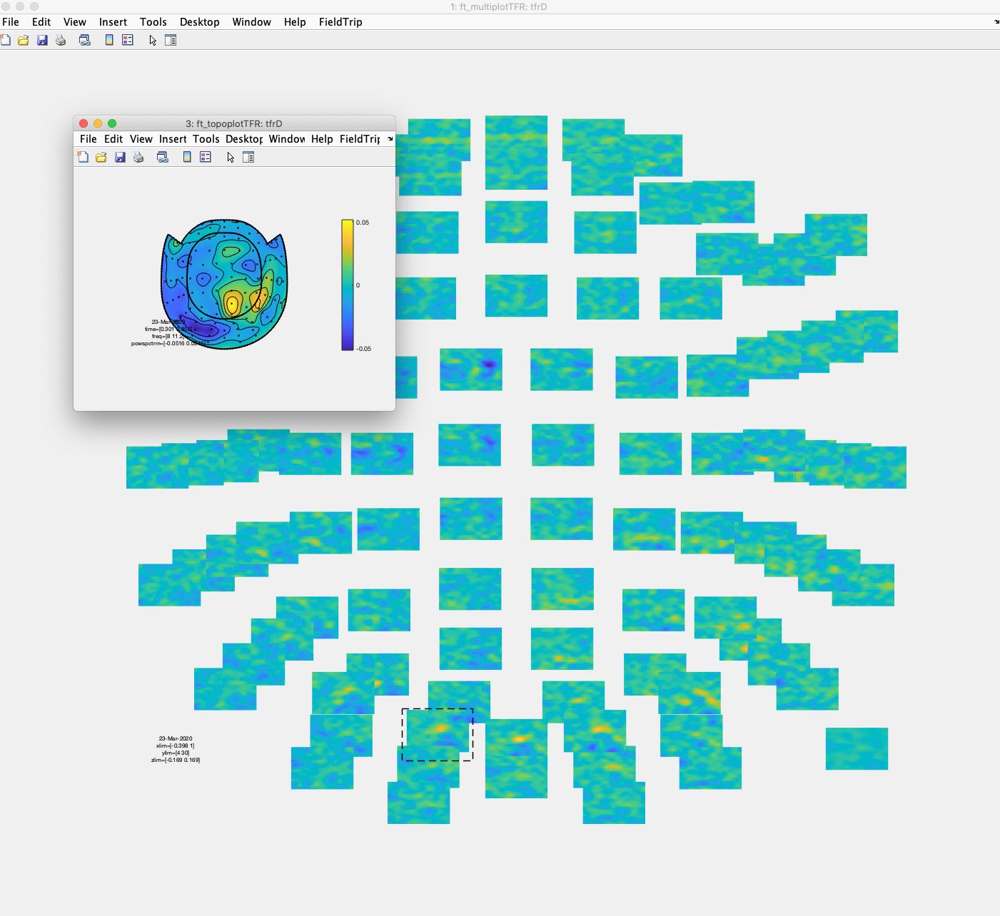

[TOC]

# Now some induced responses

As you recall from *M/EEG 101* averaging the (preprocessed) time-series over trials for your evoked responses preserves the time- and phase-locked parts: everything else is averaged away. Obviously neural data is richer than only the evoked parts. Take a look at this image from this [paper](https://www.researchgate.net/publication/2873287_Object_Representation_and_Gamma_Oscillations) ...



Talk to your local electrophysiologist if you have no clue what you are seeing here in this image.

We will start by doing some analogous steps as in the previous evoked tutorial part.

```matlab
clear all
restoredefaultpath

addpath('~/Documents/MATLAB/fieldtrip/')
ft_defaults

%%

datapath='~/Dropbox/Teaching/Salzburg/PhD/Fieldtrip_2020/Data/';
epoch_file='epochs.mat';

load(fullfile(datapath, epoch_file))

%% Add bit on trial
trialnums = [length(find(alldata.trialinfo == 2)), ...
                length(find(alldata.trialinfo == 4 | alldata.trialinfo == 5)), ...
                length(find(alldata.trialinfo == 8 | alldata.trialinfo == 9))];
          
ind_inf_low = find(alldata.trialinfo == 4 | alldata.trialinfo == 5);
ind_inf_low_300 = ind_inf_low(randsample(600, 300));

ind_inf_high = find(alldata.trialinfo == 8 | alldata.trialinfo == 9);
ind_inf_high_300 = ind_inf_high(randsample(600, 300));
```

## Low frequencies (< 30 Hz)

Now we should have the epochs loaded and some trials selected for the informative and uninformative condition. For running spectral analysis the relevant function would be *ft_freqanalysis.m*. This gives us multiple options. The first thing to make up your mind about is whether the *time-*dimension is relevant for the question you are asking. We are interested in particular in the cue-target period an let's pretend for now that we are not interested in time. The relevant *method* option would then be *'mtmfft'*.

```matlab
cfg=[];
cfg.toilim =[0 1];
tmpallpdata_short = ft_redefinetrial(cfg, alldata);

cfg              = [];
cfg.output       = 'pow';
cfg.method       = 'mtmfft';
cfg.taper        = 'hanning';
cfg.foi          = 4:1:30;                          

cfg.trials = find(alldata.trialinfo == 2)'; %all uninformative trials
powU= ft_freqanalysis(cfg,  tmpallpdata_short);

cfg.trials = [ind_inf_low_300; ind_inf_high_300]'; %selection informative
powI= ft_freqanalysis(cfg,  tmpallpdata_short);

powU = ft_combineplanar([],powU);
powI = ft_combineplanar([],powI);

clear tmpallpdata_short
```

For now we are only interested in the lower frequency responses. We can use the *ft_multiplotER* function to display the results.

```matlab
cfg=[];
cfg.layout='neuromag306cmb_helmet.lay'; 
ft_multiplotER(cfg, powU, powI)
```

You should see that (as usual) the posterior alpha activity is dominant and that there seems to be some modulation by the cue information. However, without some normalization fine patterns do not become immediately visible. 

Here we contrast the power spectra using a relative change measure.

```matlab
powD = powU;
powD.powspctrm = log10(powI.powspctrm ./ powU.powspctrm);

cfg=[];
cfg.layout='neuromag306cmb_helmet.lay'; 
ft_multiplotER(cfg, powD)
```

Manually averaging over an alpha range we see that for a large amount of posterior and (left) temporal sensors (note these are planar gradiometers) alpha is reduced for the informative condition, but there also seems to be an "island" of increased alpha over right parietal areas.



In our previous analysis we were not interested in time. Obviously this may be an interesting feature to also look at in the cue target interval. The critical ingredient when doing your *ft_freqanalysis* call is to use one of the options that yield time-frequency information, *'mtmconvol'* being the most common. This performs (multi-)tapered FFT on time-shifted windows, i.e. the length and the centre of your windows need to be specified. In our case we focus again on the low frequencies

```matlab
cfg              = [];
cfg.output       = 'pow';
cfg.method       = 'mtmconvol';
cfg.taper        = 'hanning';
cfg.foi          = 4:1:30;                          %the frequencies you want
cfg.t_ftimwin    = ones(length(cfg.foi),1).*0.5;  	%the length of the time-windows
cfg.toi          = -.4:.05:1;               				%start and end of your analysis

cfg.trials = find(alldata.trialinfo == 2)'; %all uninformative trials
tfrU= ft_freqanalysis(cfg,  alldata);

cfg.trials = [ind_inf_low_300; ind_inf_high_300]'; %selection informative
tfrI= ft_freqanalysis(cfg,  alldata);

tfrU = ft_combineplanar([],tfrU);
tfrI = ft_combineplanar([],tfrI);
```

Note that you can adapt many aspects such as the length of your time windows. We can use another *multiplot*-function to visualize the time-frequency responses. For 'sanity' check purposes we will only plot the informative condition and add some baseline normalization for display purposes.

```matlab
cfg=[];
cfg.layout='neuromag306cmb_helmet.lay';
cfg.baseline = [-.4 -.1];
cfg.baselinetype = 'relchange'; 			%This is ONLY applied to the visualizaton
cfg.zlim = 'maxabs';
ft_multiplotTFR(cfg, tfrI)
```

Again you can use the neat interactive options to explore your data. Here is what I see for an upper alpha range.



To see whether there are any marked condition differences let's again do some contrasting.

```matlab
tfrD = tfrI;
tfrD.powspctrm = log10(tfrI.powspctrm ./ tfrU.powspctrm);

cfg=[];
cfg.layout='neuromag306cmb_helmet.lay'; 
ft_multiplotER(cfg, tfrD)
```

Obviously there are no big surprises with respect to the previous figure displaying the differences in the power spectra.




## High frequencies (> 30 Hz)

Especially in EEG it is less common, but here we have clean MEG and plenty of trials. So why not take a sneaky-peak into the higher frequencies as well. Basically the code is very similar, with the main difference now is that we are performing a multitaper FFT and specifying a desired smoothing bandwidth (here adapated according to frequency).

```matlab
cfg              = [];
cfg.output       = 'pow';
cfg.method       = 'mtmconvol';
cfg.taper        = 'dpss';
cfg.foi          = 35:5:90;     
cfg.tapsmofrq    = linspace(5, 10, length(cfg.foi));
cfg.t_ftimwin    = ones(length(cfg.foi),1).*0.3;  
cfg.toi          = -.4:.05:1;               

cfg.trials = find(alldata.trialinfo == 2)'; %all uninformative trials
tfrU_h= ft_freqanalysis(cfg,  alldata);

cfg.trials = [ind_inf_low_300; ind_inf_high_300]'; %selection informative
tfrI_h= ft_freqanalysis(cfg,  alldata);

tfrU_h = ft_combineplanar([],tfrU_h);
tfrI_h = ft_combineplanar([],tfrI_h);
```

For the sanity check image we will again only plot the informative condition.

```matlab
cfg=[];
cfg.layout='neuromag306cmb_helmet.lay'; %Note that the layout changed
cfg.baseline = [-.4 -.1];
cfg.baselinetype = 'relchange';
cfg.zlim = 'maxabs';
ft_multiplotTFR(cfg, tfrI_h)
```

Also we can again take a look at a condition contrast using analogous code as above.

