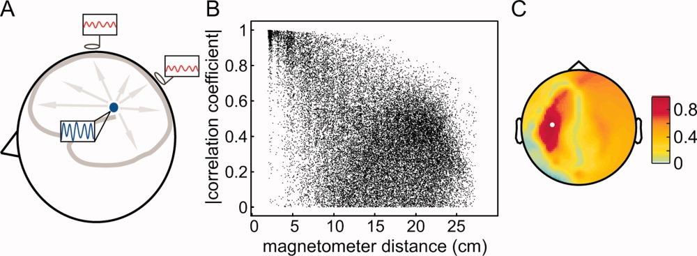
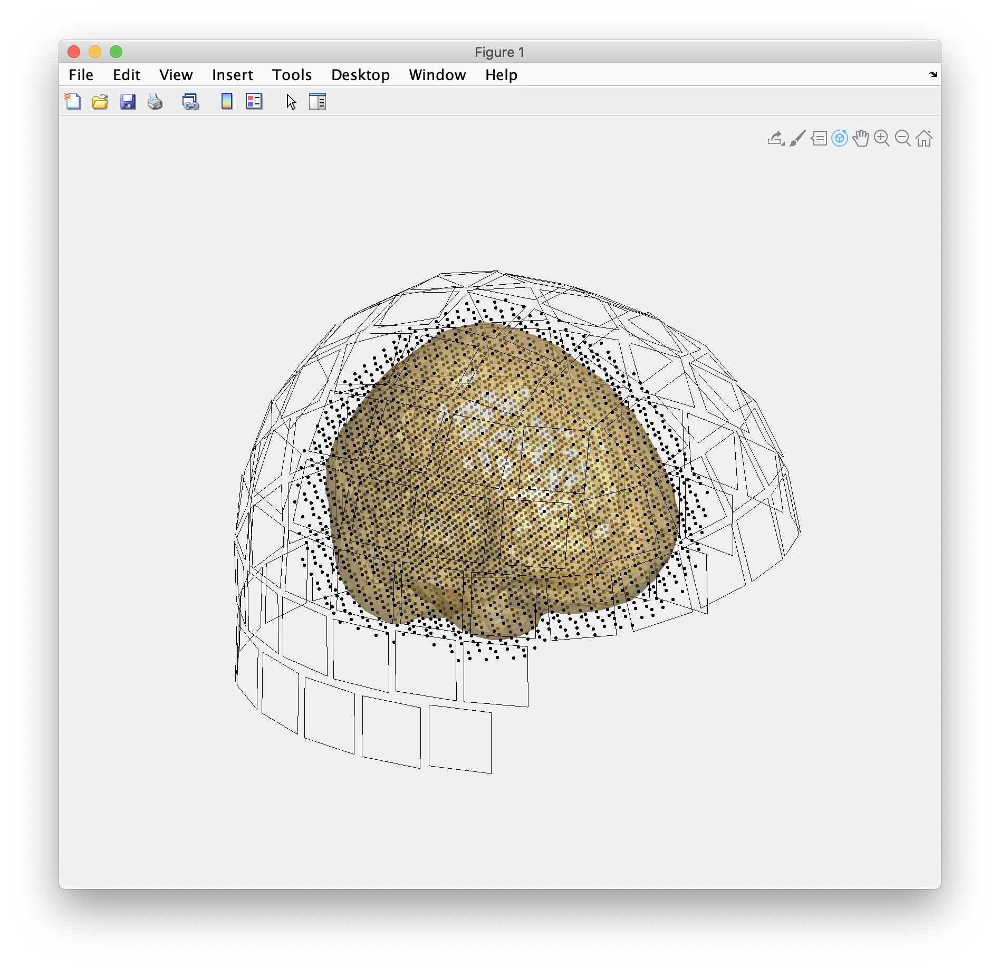
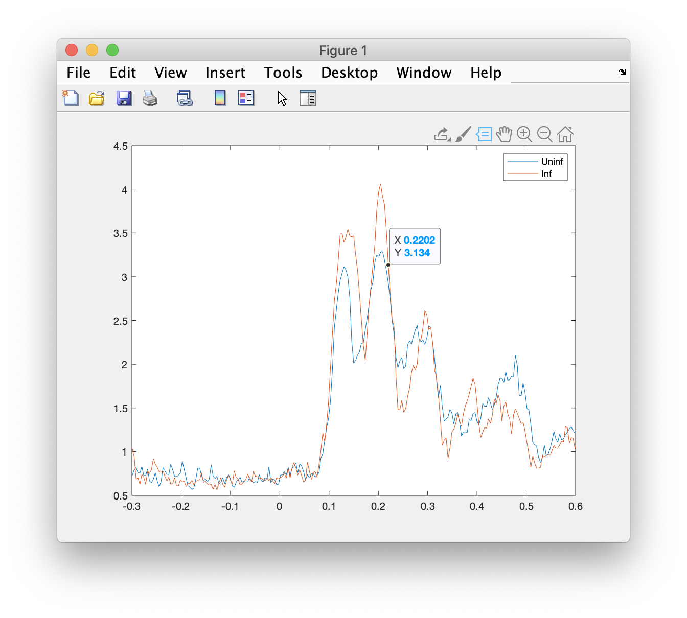
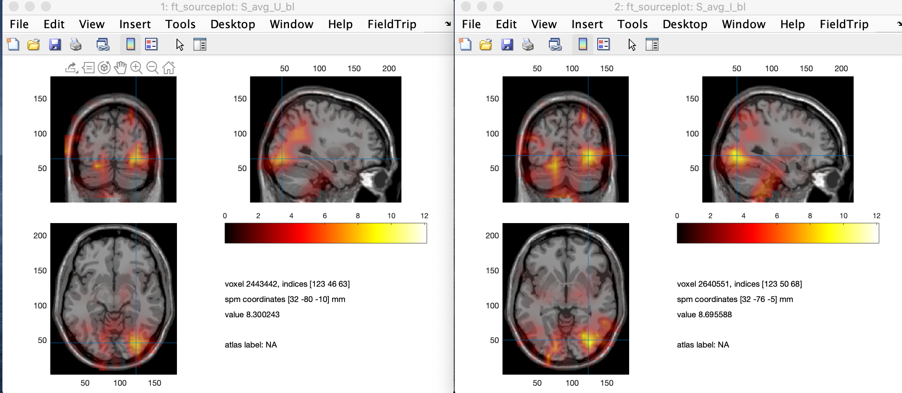
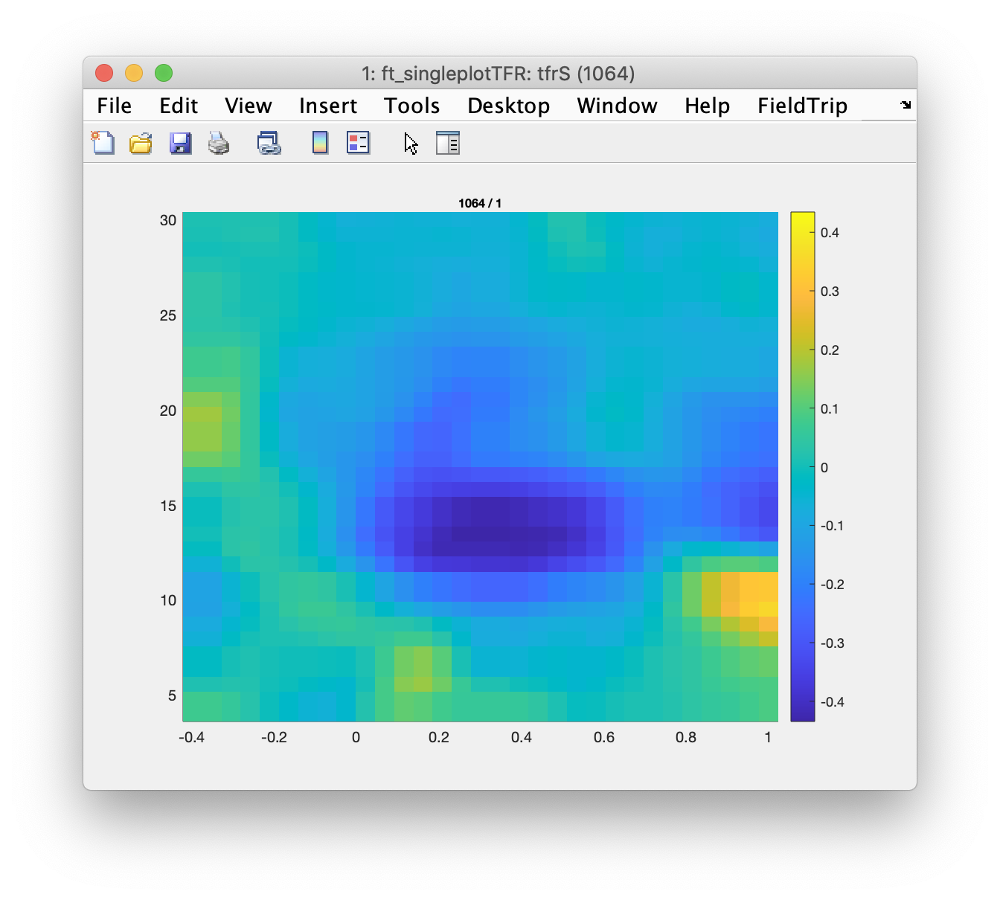

# Why source analysis?

One sensor on the scalp / near the head **never** captures activity only from an isolated brain region: Activity from one "source" will be captured by multiple electrodes / sensors, so that each electrode / sensor sees a weighted mix of multiple sources (see e.g. [Schoffelen and Gross, 2009](https://onlinelibrary.wiley.com/doi/full/10.1002/hbm.20745)). 



To make things even worse, also a lot of non-neural activity is seen by the electrodes / sensors. Next to good measurements and preprocessing, using source analysis is another strategy to reduce the artefactual influence and thereby improve the SNR.

Putting artefacts aside, you need to reflect whether the fact that your electrodes / sensors see a mix of neural sources is a problem for you. Generations of researchers have fared well by investigating e.g. a single EEG component without caring too much about its generation. In more modern MVPA approaches, frequently the spatial information is also discarded. You would care about source analysis when:

* you do want to make claims about the generators (i.e. saying that an effect in Fz reflects frontal activity is problematic at the least)
* you want to do connectivity analysis, given that on a electrode / sensor level activity time-series will be highly correlated


# The ingredients for source analysis

Apart of the M/EEG data that you have recorded from many locations around the head and your favourite source localization algorithm (=*inverse operator*), you need to create a *forward model* which estimates for a defined location in the brain the surface (M/EEG) signal it would produce. The forward model is captured in the so-called leadfield matrix. In order to obtain this crucial piece of information you need:

* a model of the head (volume conduction model) --> *ft_prepare_headmodel.m*
* the location of the sensors or electrodes with respect to the head. 
* the points that you define as sources, for which you want to have activity estimated --> *ft_prepare_sourcemodel.m*


# Now you don't have an MRI ...

Sometimes we cannot collect an individual MRI for each subject or this can only be done at a later time point. *obob_ownft* offers some functionality (resorting to some SPM tools) to use a template brain for source analysis. In brief, what is done is to warp the MNI-single-subject MRI to fit the headshape of each subject. **So never skip the headshape step when doing MEG**. You may get away with some template electrode positions using EEG. The subsequent code shows you how to get this aligned MRI (if you want to skip running this code, then download the mat-file [here](https://www.dropbox.com/s/fjof9k25hdzwumq/headstuff4DK2020.mat?dl=0).

```matlab
restoredefaultpath
clear all

addpath('~/.CMVolumes/Bomber/obob/obob_ownft/') %ADD YOUR PATH TO OBOB_OWNFT

cfg = [];
obob_init_ft(cfg); 


datapath='~/Dropbox/Teaching/Salzburg/PhD/Fieldtrip_2020/Data/';

grad = ft_read_sens(fullfile(datapath, '19890425HRWL_block01_trans_sss.fif'));

%%
grad = ft_convert_units(grad, 'm');

cfg = [];
cfg.headshape = fullfile(datapath, '19890425HRWL_block01_trans_sss.fif');
cfg.mrifile = [];
cfg.sens = grad;
 
[mri_aligned, headshape, hdm, mri_segmented] = obob_coregister(cfg);

save(fullfile(datapath, 'headstuff4DK2020.mat'), 'mri_aligned', 'hdm')
```

Note that using the *obob_coregister* tool automatically runs *ft_prepare_headmodel.m* for you, so you obtain a for MEG quite simple single-shell headmodel based on a method proposed by Nolte (2003). Fieldtrip includes fancier headmodels if you need them.

In general it is not a bad idea to also run your source analysis using the template brain approach. Depending on your interests the results are often quite satisfactory and a good benchmark for your manual co-registration. Using individual MRIs, your results should usually even be better. If things get worse, this is a good indication that something went wrong during your co-registration.


# Getting your forward model

Now we have almost all the ingredients mentioned above. What is missing is the defined location of the sources for which we want to estimate activity. For this we use a predefined grid with 1 cm spacing in MNI space and warp the position of these points into the head-space of the individual. This approach offers the advantage that you get sourcemodels for each individual, that have common positions in MNI space. This nice feature makes averaging and statistics across participants a lot easier.

Here some snippets that bring you to the sourcemodel.

```matlab

clear all
restoredefaultpath

addpath('~/Documents/GitHub/fieldtrip/')
ft_defaults

%%

datapath='~/Dropbox/Teaching/Salzburg/PhD/Fieldtrip_2020/Data/';
epoch_file='epochs.mat';
head_file='headstuff4DK2020.mat';

%%%%%%%%%%%%%%%%%%%%%%%%%%%%%
%% MAKE GRID AND LEADFIELD
load(fullfile(datapath, head_file))
load(fullfile(datapath, epoch_file))

%%

alldata.grad=grad;

load standard_sourcemodel3d10mm.mat
alldata.grad = ft_convert_units(alldata.grad, 'm');
headshape=ft_convert_units(headshape, 'm');
mri_aligned=ft_convert_units(mri_aligned, 'm');
hdm=ft_convert_units(hdm, 'm');
sourcemodel=ft_convert_units(sourcemodel, 'm');


cfg           = [];
cfg.warpmni   = 'yes';
cfg.template  = sourcemodel;
cfg.nonlinear = 'yes';
cfg.mri       = mri_aligned;
cfg.unit      ='m';
grid          = ft_prepare_sourcemodel(cfg);


figure
hold on
ft_plot_headmodel(hdm, 'facecolor', 'cortex', 'edgecolor', 'none');alpha 0.5; camlight;
ft_plot_mesh(grid.pos(grid.inside,:));
ft_plot_sens(alldata.grad);
```

This is what you should see (use the Rotate3D tool):



Now you are ready to compute your leadfield.

```matlab
restoredefaultpath

addpath('~/Documents/GitHub/obob_ownft/')
obob_init_ft;

cfg = [];
cfg.grid = grid;
cfg.vol = hdm; % subject specific headmodel /volume
cfg.channel = 'MEG';
cfg.normalize = 'no'; % 'yes' or 'no'
 
lf = ft_prepare_leadfield(cfg, alldata);

save(fullfile(datapath, 'individual_grid.mat'), 'grid')
save(fullfile(datapath, 'individual_leadfield.mat'), 'lf')
```

Remember that this is an absolutely necessary procedure for any type of source analysis you want to perform. Being sloppy with your forward modeling also means your results get worse (e.g. adding noise in case your forward modeling error is not systematic).

# Source analysis the Salzburg way

The central function in Fieldtrip to then run some source analysis is *ft_sourceanalyis.m* which has different methods implemented. Which one you use depends in the end somewhat on habit and experience. This is also reflected in how well different methods are implemented. For example the Fieldtrip folks were the first among the common toolboxes to support beamformers which was the method of choice at the Donders Institute. The Brainstorm or MNE folks are more likely to use Minimum Norm. We are not ideological in this regard.

The MEG group in Salzburg has implemented a wrapper function around the ft_sourceanalysis function using lcmv-beamforming in order to obtain so-called virtual channels that are represented in a way as sensor level data (so-called preproc structure). The approach is split into two parts: the first one computes the actual beamforming filters (which require a covariance matrix obtained from ft_timelockanalysis); the second one applies the beamformer filters to the data.

```matlab
cfg=[];
cfg.preproc.lpfilter='yes';
cfg.preproc.lpfreq=30;
cfg.covariancewindow=[-.5 1];
cfg.covariance='yes';
avg4fil=ft_timelockanalysis(cfg, alldata);

cfg=[];
cfg.grid=lf;
cfg.regfac='10%';
filt = obob_svs_compute_spat_filters(cfg, avg4fil)

cfg=[];
cfg.spatial_filter = filt;
alldataS = obob_svs_beamtrials_lcmv(cfg, alldata)
```

The output *alldataS* should look like a preprocessing structure. The advantage is that now we are able to apply any sensor level method to these virtual channels. For example averaging:

```matlab
cfg=[];
cfg.latency=[-.3 .6];
cfg.trials = find(alldataS.trialinfo == 2); %all uninformative trials
avg_U = ft_timelockanalysis(cfg, alldataS);

cfg=[];
cfg.latency=[-.3 .6];
cfg.trials = [ind_inf_low_300; ind_inf_high_300]; %selection informative
avg_I = ft_timelockanalysis(cfg, alldataS);

%%
cfg=[];
cfg.baseline=[-.3 0];
cfg.baselinetype = 'relchange';
avg_U_bl=obob_svs_timelockbaseline(cfg, avg_U);
avg_I_bl=obob_svs_timelockbaseline(cfg, avg_I);

%%
plot(avg_U_bl.time, sqrt(mean(avg_U_bl.avg.^2))); hold
plot(avg_U_bl.time, sqrt(mean(avg_I_bl.avg.^2)))
legend('Uninf', 'Inf')
```

The output should look like this:



Unfortunately visualizing the data "topographically" using the normal tools (e.g. ft_multiplotER) won't work. So we have created a wrapper function to plot the info you are interested in onto a brain. Here the peak of the evoked response.

```matlab
%%

load standard_mri.mat

cfg=[];
cfg.latency=[.1 .22];
cfg.parameter='avg';
cfg.mri=mri;
cfg.sourcegrid = sourcemodel; %=template source model
S_avg_U_bl=obob_svs_virtualsens2source(cfg, avg_U_bl);
S_avg_I_bl=obob_svs_virtualsens2source(cfg, avg_I_bl);

%%

cfg = [];
cfg.method        = 'ortho';
cfg.funparameter  = 'avg';
cfg.maskparameter = cfg.funparameter;
cfg.funcolorlim   = [0.0 max(S_avg_I_bl.avg(:))];
ft_sourceplot(cfg, S_avg_U_bl);

cfg.funcolorlim   = [0.0 max(S_avg_I_bl.avg(:))];
ft_sourceplot(cfg, S_avg_I_bl);
```

Note that we are using the MNI brain along with the grid positions in MNI space. This allows me to also use an atlas if I wanted to. You should see something like this:




You can also plot the difference.

```matlab
S_avg_Diff=S_avg_U_bl;
S_avg_Diff.avg=(S_avg_I_bl.avg-S_avg_U_bl.avg);

cfg = [];
cfg.method        = 'ortho';
cfg.funparameter  = 'avg';
cfg.maskparameter = cfg.funparameter;
cfg.funcolorlim   = [0.0 max(S_avg_Diff.avg(:))];
ft_sourceplot(cfg, S_avg_Diff);
```

As said *alldataS* is like a preprocessing structure so you can do anything that you could apply on sensor level data. Some things however may be computationally too heavy (e.g. connectivity analysis) or you are only interested in one or a few specific locations. This could be done in many ways, e.g. by defining a new sourcemodel with only a few ROIS. Here I will take one point closest to the maximum evoked response in visual cortex. We will apply time-frequency analysis, just for fun. 

```matlab
%% [-32 -76 -5] ... MAXIMUM EVOKED RP

Dist2ROI=sourcemodel.pos(sourcemodel.inside,:) - repmat([-32 -76 -5]/1000, ... 
                size(sourcemodel.pos(sourcemodel.inside,:),1),1);

[mindist minind]=min(sqrt(sum(Dist2ROI.^2,2))); % find closest source

%%

cfg              = [];
cfg.channel      =  alldataS.label{minind};
cfg.output       = 'pow';
cfg.method       = 'mtmconvol';
cfg.taper        = 'hanning';
cfg.foi          = 4:1:30;                          
cfg.t_ftimwin    = ones(length(cfg.foi),1).*0.5;  
cfg.toi          = -.4:.05:1;               

tfrS= ft_freqanalysis(cfg,  alldataS);

%%

cfg=[];
cfg.baseline=[-.4 -.1];
cfg.baselinetype = 'relchange';
cfg.zlim='maxabs';
ft_singleplotTFR(cfg, tfrS)
```

Unsurprisingly you can see a crisp desynchronization in the alpha / beta range.

